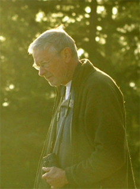

## Project Summary

Harvey Janszen (July 11, 1946–May 10, 2021) was an accomplished amateur botanist and naturalist endeared to many in British Columbia's natural history community. During his career, Harvey collected over 3,000 vascular plant specimens, mostly from the southern Gulf Islands of British Columbia, and curated comprehensive species checklists documenting the flora of the southern Gulf Islands, Saanich Peninsula, San Juan Islands, and various other localities throughout the Salish Sea. 

{.data-pane}

```{r, echo=FALSE, warning=FALSE, message=FALSE}
source("scripts/basemap.R")
Map
```

## History of collection activities

Chronicling this legacy, Harvey left behind field journals documenting his collection activities throughout the region, from 1973 to 2017. Many of these historical baseline records have not been digitized and so remain unavailable to the scientific community. Through the Janszen Legacy Project, we are actively curating and preserving these important records, including herbarium specimens, list records, and field notes. In the following maps, we provide a summary of the progress of this initiative to date, with reference to the journals and species lists that Harvey left us with.

```{r, echo=FALSE, warning=FALSE, message=FALSE}
source("scripts/overview.R")
Map
```

## Flora of Saturna ca. 1973–1981

Journal documenting Harvey’s earliest collections, including a total of 1,929 specimens collected from the Ballingall Islets, Galiano Island, Georgeson Island, Mayne Island, North Pender Island, Parker Island, Salt Spring Island, Samuel Island, Saturna Island, South Pender Islands, and Wise Island, with a focus on the flora of Saturna Island. This floristics project formed the basis for Harvey's 'Vascular plants of Saturna Island, British Columbia' which in 1977 appeared in *Syesis*, a scholarly journal published by the British Columbia Provincial Museum.

{.data-pane}

```{r, echo=FALSE, warning=FALSE, message=FALSE}
source("scripts/1973–1981.R")
Map
digitized.records.plot
digitized.journal.plot
```

## Journal ca. 1981–1996

Journal documenting floristic surveys of Burnaby Lake, Burns Bog, Cabbage Island, Campbell River, Chilliwack River Provincial Park, Denman Island, Galiano Island, Golden Ears Provincial Park, Hornby Island, Isabella Islets, Lopez Island, Mayne Island, North Pender, Orcas Island, Parker Island, Powell River, Prevost Island, Qualicum Beach, Salt Spring Island, San Juan Island, Saturna Island, Sidney Island, Somenos Lake, South Pender, the Squamish estuary, Stanley Park, Texada, the UBC Research Forest, Waldron Island, Wise Island, and Wolf Creek. The journal includes collections numbering from 1,930 to 2,629.

{.data-pane}

```{r, echo=FALSE, warning=FALSE, message=FALSE}
source("scripts/1981-1996.R")
Map
digitized.records.plot
digitized.journal.plot
```

## Journal ca. 1996-2000

Journal documenting floristic surveys of: Metchosin, Saturna Island, Saltspring Island, Sidney Island, Texada Island, Tumbo Island, and Valdes Island. The journal includes collection records numbering from 2,630 to 2,920, including detailed population assessments and georeferenced localities for *Woodwardia* and various Ophioglossaceae, as well as field notes and species lists.

{.data-pane}

```{r, echo=FALSE, warning=FALSE, message=FALSE}
source("scripts/1996-2000.R")
Map
digitized.records.plot
digitized.journal.plot
```

## Unbound field notes ca. 1999–2003

Field notes documenting floristic inventories of: the Cowichan River, Galiano Island, Hornby Island, Mount Tzouhalem, Saturna Island, Sidney Island, and surveys targeting *Crassula connata* on Saltspring Island, Tree Island, and Valdes Island. Collections numbering from 2,921–2,961.

{.data-pane}

```{r, echo=FALSE, warning=FALSE, message=FALSE}
source("scripts/1999-2003.R")
Map
digitized.records.plot
digitized.journal.plot
```

## Field notes ca. 2003–2017

Field notes documenting floristic inventories of Galiano Island, Lake Helen Mackenzie, Saturna Island, Strathcona Provincial Park, Tumbo Island, and Valdes Island—including records of rare vascular plant species such as *Meconella oregana*, *Ranunculus californicus*, and *Sanicula bipinnatifida*. Collections numbering from 2,962–2,971.

{.data-pane}

```{r, echo=FALSE, warning=FALSE, message=FALSE}
source("scripts/2003-2017.R")
Map
digitized.records.plot
digitized.journal.plot
```

## Curation of regional species lists

Before Harvey passed, he reached out to others in the community to invite their review of the comprehensive species lists he had dedicated his life to compiling for the region. Today, we are honouring his final request and collectively reviewing the flora of the southern Gulf Islands, Saanich Peninsula, San Juan Islands, and surrounding islets. Curation of the flora of the San Juan Islands is being led by Peter Dunwiddie and Adam Martin. Annotated checklists documenting the flora of the Saanich Peninsula and southern Gulf Islands will be published as an open access resource under Harvey's name.

```{r, echo=FALSE, warning=FALSE, message=FALSE}
source("scripts/comprehensive_lists.R")
Map
```

## Proposed project outcomes

Harvey's dataset establishes a critical baseline record of the vascular plant diversity of the southern Gulf Islands, Saanich Peninsula, and San Juan Islands. This baseline is a vital resource for conservation, improving our general understanding of the floristics of the region and establishing a basis for understanding future ecological change. 

Through this initiative, we are carrying on Harvey's legacy by:

* Curating and publishing comprehensive species lists for the southern Gulf Islands, San Juan Islands, Saanich Peninsula and surrounding islets

* Digitizing, imaging, and depositing Harvey's last vascular plant specimens in research collections at UBC

* Reviewing, digitizing and imaging the specimens that Harvey accessioned which remain undigitized in collections at the Royal BC Museum and UBC Herbarium

* Digitizing Harvey's journals, including list records and field observations

* Curating this dataset to DarwinCore standards for publication in an open access data depository

## Acknowledgments

We thank those who have come together to honour the life and legacy of Harvey Janszen:

Geraldine Allen, Antranig Basman, Ryan Batten, Eleanor Brouard-John, Adolf Ceska, Quentin Cronk, Ian Cruickshank, Marta Donovan, Peter Dunwiddie, Matt Fairbarns, David Giblin, Pam Janszen, Linda Jennings,  Mike Lavender, Pippi Lawn, Frank Lomer, Terry Ludwar, Kendrick Marr, Andy MacKinnon, Adam Martin, Emma Menchions, James Miskelly, Jenifer Penny, Hans Roemer, Andrew Simon, Angela Wood, and Alexander Wright.

This project generously supported by the [Canadian Institute for Ecology and Evolution](https://www.ciee-icee.ca/ldp.html) and the [Institute for Multidisciplinary Ecological Research in the Salish Sea](https://www.imerss.org)

\

```{r setup, include=FALSE}
knitr::opts_chunk$set(echo = TRUE)
```
